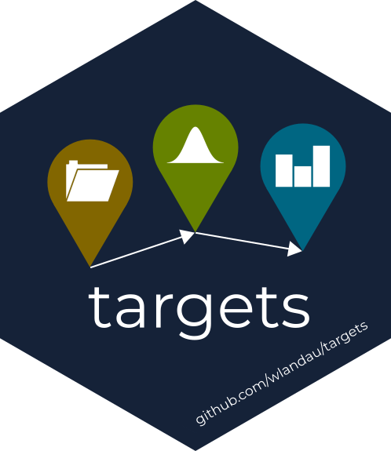
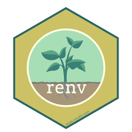

```{r setup, include=FALSE}
knitr::opts_chunk$set(echo = TRUE)
```

The project is available on _[github](https://github.com/samuelcharberet/project.frb.fisheries)_

## 1. R work environment
For this project we used:  

<div class="columns-2">

* Targets to manage our workflow

{width=25%}

</div>

<div class="columns-2">

{width=32%}

* renv to make our R environment reproducible  

</div>

<div class="columns-2">

* Rmarkdown to generate both this presentation and a Latex report  

{width=25%}

</div>


* ggplot2  to visualize our data


## 2. Question

How much carbon (C), nitrogen (N), and phosphorus (P) is extracted every year from the Barents Sea through fishing ?

<center>
{width=60%}
</center>


## 2. Data
### 2.1. Data extracted  

* __Carbone (C), Nitrogen (N), Phosphorus (P)__ content (% of dry mass) from Jabot, F. et al., (2020): Dataset for the article "Body stoichiometry of heterotrophs: assessing drivers of interspecific variations in elemental composition". figshare. Dataset. https://doi.org/10.6084/m9.figshare.13366310.v1  


* __Tonnage__ from _Sea Around Us_ We downloaded data for the Barents Sea area on the Website:  https://www.seaaroundus.org/

<center>
{width=10%}
</center>


* __Taxonomic data__ from the Global Biodiveristy Information Facility (GBIF)

<center>
{width=10%}
</center>

---

### 2.2. Data manipulation  

Having two different dataset has required to join them. However, the species name were not exactly noted the same way on the two documents. Therefore we had to do some cleaning on both datasets.


### 2.3. Final dataset  

Our final dataset contains:  
* Carbone (C)  
* Nitrogen (N)  
* Phosphorus (P)  
* Species (n species of fishes)  
* Tonnage  
* Countries  
* Type of gear  


## 3. Analyses and vizualisation

### Representation of our results
```{r  echo=FALSE, fig.align="center"}
targets::tar_read(plot_CNP_exp)
```

---

```{r  echo=FALSE, fig.align="center"}
targets::tar_read(plot_landedval_sp)
```

## 4. Workflow 

### vizualisation of tar_visnetwork

<center>
{width=80%}
<center>


